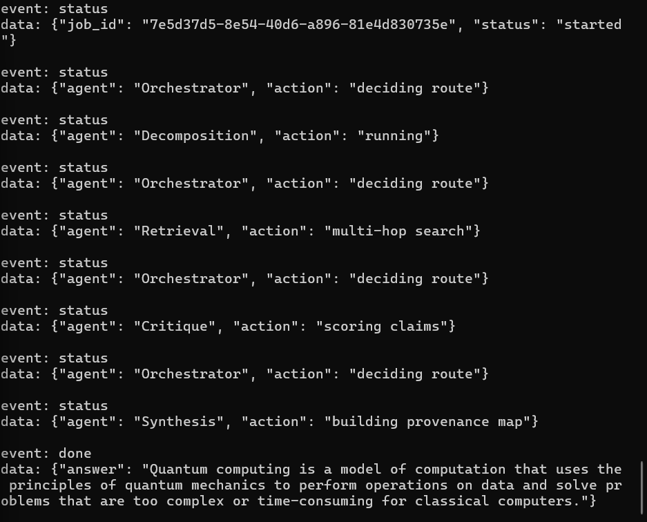
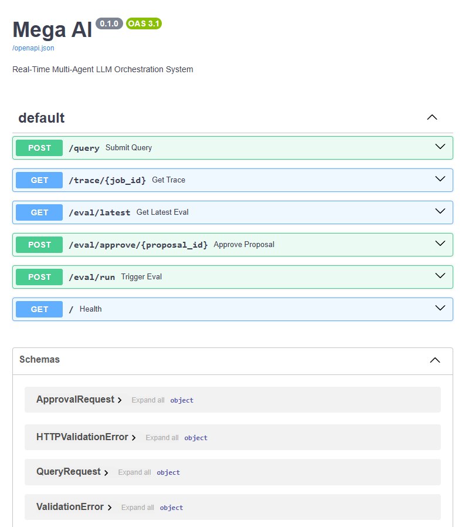

# Mega AI — Real-Time Multi-Agent LLM Orchestration

Built with LangGraph, FastAPI, PostgreSQL, pgvector, LiteLLM, and real-time SSE orchestration.

A production-grade multi-agent orchestration framework built with FastAPI, LangGraph, PostgreSQL, pgvector, and structured LLM agents.

The system decomposes complex tasks into specialized reasoning stages:

```text
Decomposition → Retrieval → Critique → Synthesis
```

Each stage is independently observable, evaluated, and streamable in real time through Server-Sent Events (SSE).

---

# Real-Time Multi-Agent Streaming

The orchestrator streams live execution events over SSE while routing tasks across specialized agents.



---

# API Documentation

Interactive OpenAPI documentation generated automatically with FastAPI.



---

# Features

- Real-time multi-agent orchestration using LangGraph
- Streaming SSE responses
- Structured Pydantic schemas across all agents
- PostgreSQL + pgvector architecture
- Tool failure contracts (no raw exceptions)
- Context budget management using tiktoken
- Execution tracing + observability pipeline
- Evaluation harness with LLM-as-a-judge scoring
- Self-improving prompt rewrite proposal system
- Async-first architecture

---

# Quick Start

## 1. Clone repository

```bash
git clone https://github.com/0xnotdev/mega-ai.git
cd mega-ai
```

---

## 2. Configure environment

Create `.env`:

```env
GROQ_API_KEY=your_key_here
```

Optional:

```env
E2B_API_KEY=your_key_here
LOG_LEVEL=INFO
```

---

## 3. Start stack

```bash
docker compose up --build
```

---

# Access

| Service | URL |
|---|---|
| API | http://localhost:8000 |
| Swagger Docs | http://localhost:8000/docs |

---

# Architecture

Hub-and-spoke directed acyclic graph orchestration:

```text
                    ┌─────────────────┐
                    │  Orchestrator   │
                    └────────┬────────┘
                             │
         ┌───────────────────┼───────────────────┐
         │                   │                   │
         ▼                   ▼                   ▼
 ┌──────────────┐   ┌──────────────┐   ┌──────────────┐
 │Decomposition │ → │  Retrieval   │ → │   Critique   │
 └──────────────┘   └──────────────┘   └──────────────┘
                                                   │
                                                   ▼
                                          ┌──────────────┐
                                          │  Synthesis   │
                                          └──────────────┘
```

---

# Agent System

| Agent | Responsibility | Output Schema |
|---|---|---|
| Decomposition | Converts user query into DAG subtasks | `DecompositionResult` |
| Retrieval | Performs multi-hop retrieval reasoning | `RetrievalResult` |
| Critique | Scores claim confidence + contradictions | `CritiqueResult` |
| Synthesis | Produces provenance-mapped final response | `SynthesisResult` |

---

# API Endpoints

| Endpoint | Purpose |
|---|---|
| `POST /query` | Streaming multi-agent execution |
| `GET /trace/{job_id}` | Full execution trace |
| `GET /eval/latest` | Latest evaluation results |
| `POST /eval/approve/{id}` | Approve prompt rewrite |
| `POST /eval/run` | Run evaluation harness |

---

# Execution Tracing

Every orchestration run is persisted with structured trace spans for debugging and observability.


---

# Example SSE Query

```bash
curl -N -X POST http://localhost:8000/query \
-H "Content-Type: application/json" \
-d '{"query":"What is machine learning?"}'
```

---

# Evaluation System

The framework includes:

- baseline factual tests
- ambiguity handling tests
- adversarial prompt injection tests
- contradiction traps
- LLM-as-a-judge scoring
- agent-level performance analysis

Metrics scored:

- answer correctness
- citation accuracy
- contradiction resolution
- critique agreement
- tool efficiency
- budget compliance

---

# Self-Improving Meta-Agent

The evaluation system can:

- identify weakest-performing agent
- propose rewritten system prompts
- generate unified diffs
- store proposals in PostgreSQL
- support human approval workflows

The system DOES NOT:

- auto-modify Python code
- auto-deploy prompt rewrites
- guarantee improvements

Human approval is required.

---

# Tech Stack

| Layer | Technology |
|---|---|
| API | FastAPI |
| Orchestration | LangGraph |
| Validation | Pydantic |
| Database | PostgreSQL |
| Vector DB | pgvector |
| LLM Gateway | LiteLLM |
| Models | Groq Llama 3.1 |
| Streaming | SSE |
| Containers | Docker |
| Token Budgeting | tiktoken |

---

# Observability

The system logs:

- agent execution traces
- token usage
- latency
- routing decisions
- policy violations
- tool usage
- evaluation results

All traces are persisted in PostgreSQL.

---

# Known Limitations

- Retrieval currently uses mock chunks unless pgvector ingestion is added
- E2B execution sandbox requires paid API access
- Context compression is heuristic-based
- Groq free-tier TPM limits may throttle evaluations
- Prompt rewrites improve prompts only, not orchestration logic

---

# Future Improvements

- Real pgvector ingestion pipeline
- Hybrid BM25 + vector retrieval
- Streaming token-by-token synthesis
- React graph visualization frontend
- Redis/Celery distributed eval workers
- Human feedback RL loop
- Multi-model ensemble routing
- OpenTelemetry integration

---

# Project Goal

Mega AI explores how deterministic orchestration, structured schemas, evaluation harnesses, and self-improving prompt systems can be combined into production-grade multi-agent AI infrastructure.